# ColdChain — Entity State Machines

**Version**: 1.0  
**Date**: March 2026  
**Derived from**: Functional Specs, BRD, Data Model, API Design, E2E Workflows

---

## 1. Lot Lifecycle

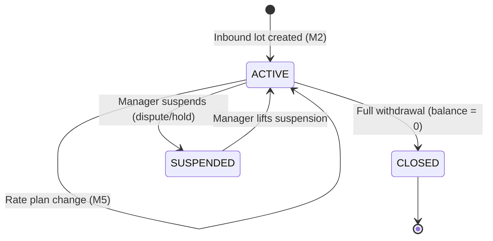

**Transitions & Rules:**

| From | To | Trigger | Business Rule |
|---|---|---|---|
| — | ACTIVE | Lot created at inbound | Must have owner, chamber, rate plan |
| ACTIVE | ACTIVE | Partial withdrawal | `current_balance -= qty`; balance must stay ≥ 0 |
| ACTIVE | ACTIVE | Ownership transfer | owner_party_id updated; ownership_history appended |
| ACTIVE | ACTIVE | Spoilage confirmed | `current_balance -= spoiled_qty`; MANAGER approval required |
| ACTIVE | CLOSED | Full withdrawal finalized | `current_balance = 0`; `closed_at = today` |
| ACTIVE | SUSPENDED | Manual hold by manager | No withdrawals or transfers allowed while suspended |
| SUSPENDED | ACTIVE | Manager lifts hold | All operations resume |

---

## 2. Invoice Lifecycle

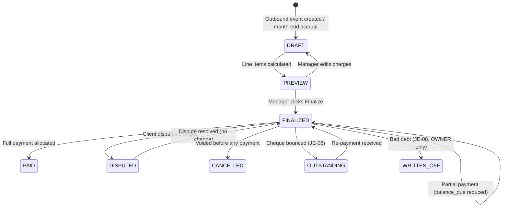

**Transitions & Rules:**

| From | To | Trigger | Business Rule |
|---|---|---|---|
| — | DRAFT | Outbound event created or month-end | No invoice_number yet |
| DRAFT | PREVIEW | Charges auto-calculated | Manager reviews before finalize |
| PREVIEW | FINALIZED | Manager finalizes | invoice_number assigned (INV-YYYYMM-NNNN); immutable; JE-01 posted |
| FINALIZED | PAID | `amount_paid = total` | All allocations complete |
| FINALIZED | DISPUTED | Client raises dispute | Credit note may follow |
| FINALIZED | CANCELLED | Voided (no payments yet) | Only if `amount_paid = 0` |
| FINALIZED | OUTSTANDING | Cheque dishonoured | JE-06 reverses payment; AR re-opened |
| FINALIZED | WRITTEN_OFF | OWNER writes off bad debt | JE-08 posted; OWNER only |

> **Immutability**: Once FINALIZED, the invoice record cannot be edited. Adjustments only via credit notes (JE-05).

---

## 3. Gate Pass Lifecycle

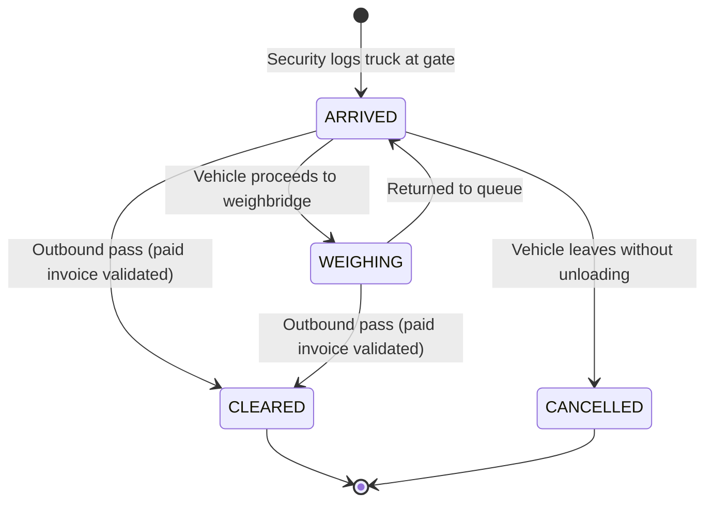

**Transitions & Rules:**

| From | To | Trigger | Business Rule |
|---|---|---|---|
| — | ARRIVED | Security logs vehicle (number, driver, bilty) | `pass_number` generated (GP-YYMMDD-NNNN) |
| ARRIVED | WEIGHING | Vehicle moves to scale area | Status update by operator |
| ARRIVED/WEIGHING | CLEARED | Security clears outbound | Must have PAID invoice OR Manager credit authorization OR approved dispatch note. `cleared_at` timestamp recorded. Turnaround time = `cleared_at - created_at` |
| ARRIVED | CANCELLED | Vehicle leaves without transaction | Manual cancellation by OPERATOR+ |

---

## 4. Spoilage Record Lifecycle

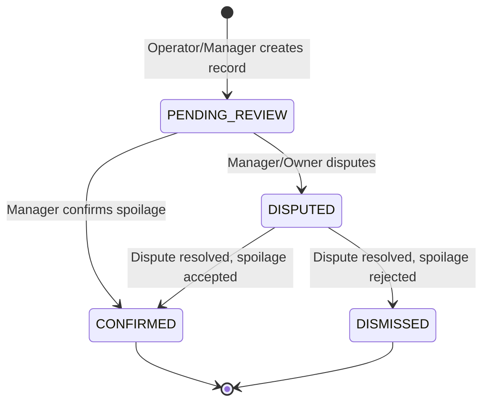

**Transitions & Rules:**

| From | To | Trigger | Business Rule |
|---|---|---|---|
| — | PENDING_REVIEW | Spoilage record created | Photos + cause required |
| PENDING_REVIEW | CONFIRMED | MANAGER+ confirms | `lot.current_balance -= quantity_affected`; owner notified; JE-09 if cold store liable |
| PENDING_REVIEW | DISPUTED | MANAGER+ disputes finding | `dispute_note` required; lot qty NOT changed |
| DISPUTED | CONFIRMED | Resolution: spoilage accepted | Same effects as direct confirmation |
| DISPUTED | DISMISSED | Resolution: no spoilage | Record archived; no lot adjustment |

---

## 5. Payment Lifecycle

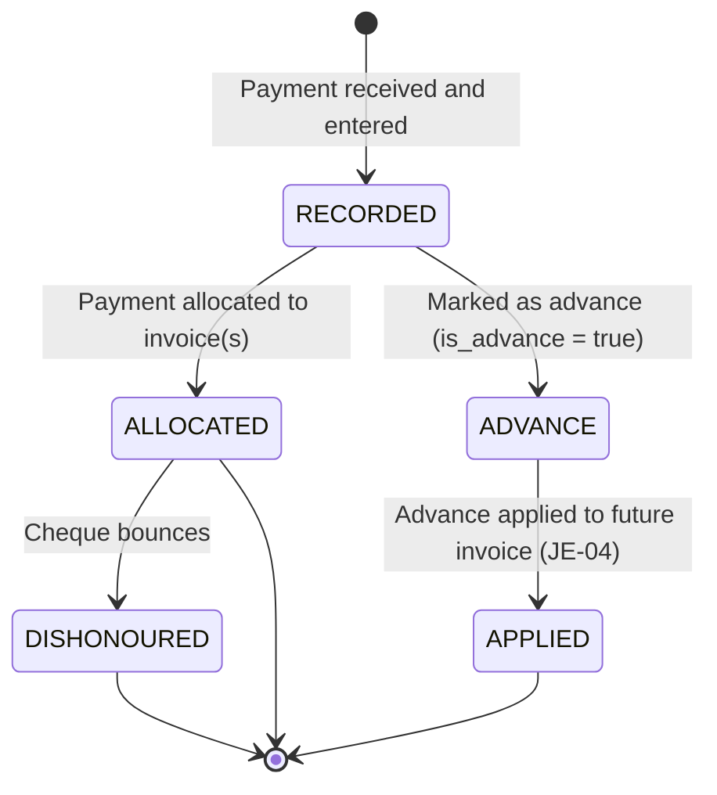

**Transitions & Rules:**

| From | To | Trigger | Business Rule |
|---|---|---|---|
| — | RECORDED | Accountant records payment | JE-02 (normal) or JE-03 (advance) |
| RECORDED | ALLOCATED | Payment linked to invoice(s) via allocations | Updates `invoice.amount_paid` |
| RECORDED | ADVANCE | `is_advance = true`, no invoice exists yet | Amount posted to liability account 2010 |
| ALLOCATED | DISHONOURED | Cheque bounces after clearance | JE-06 reversal; AR re-opened; party flagged |
| ADVANCE | APPLIED | Invoice finalized with advance offset | JE-04 (DR 2010 / CR Receivable) |

---

## 6. Outbound Event Lifecycle

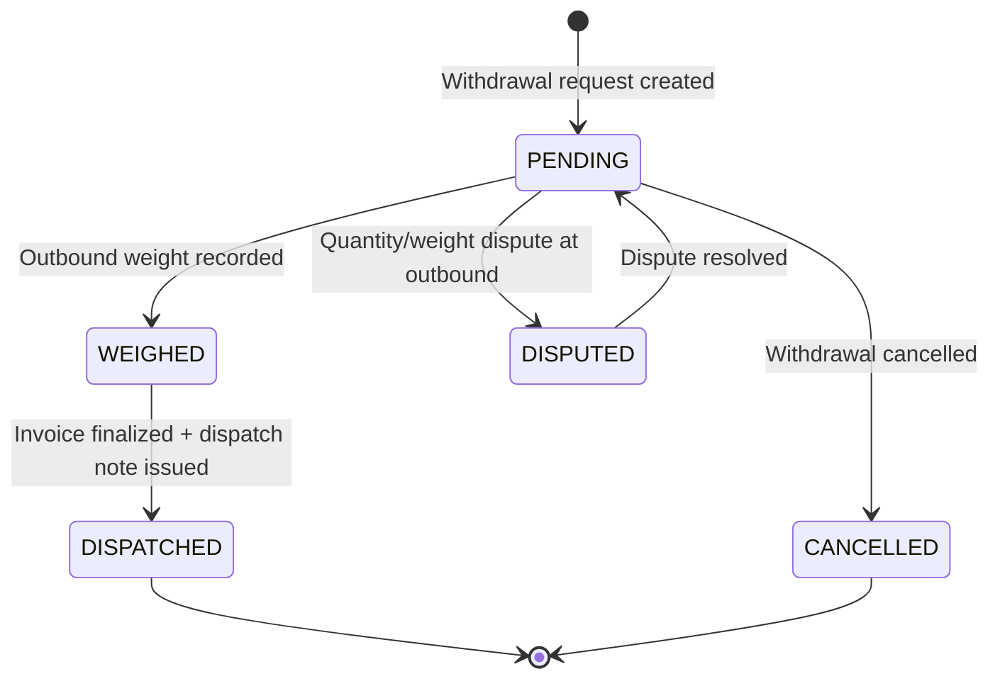

**Transitions & Rules:**

| From | To | Trigger | Business Rule |
|---|---|---|---|
| — | PENDING | Operator creates withdrawal request | `qty <= lot.current_balance` validated |
| PENDING | WEIGHED | Outbound weight entered | Weight variance displayed |
| WEIGHED | DISPATCHED | Invoice finalized by MANAGER+ | Lot balance updated; dispatch note generated; JE-01 posted |
| PENDING | CANCELLED | Withdrawal cancelled before dispatch | Lot balance unchanged |
| PENDING | DISPUTED | Quantity dispute at outbound | Lot qty held; note required |

---

## 7. Credit Note Lifecycle

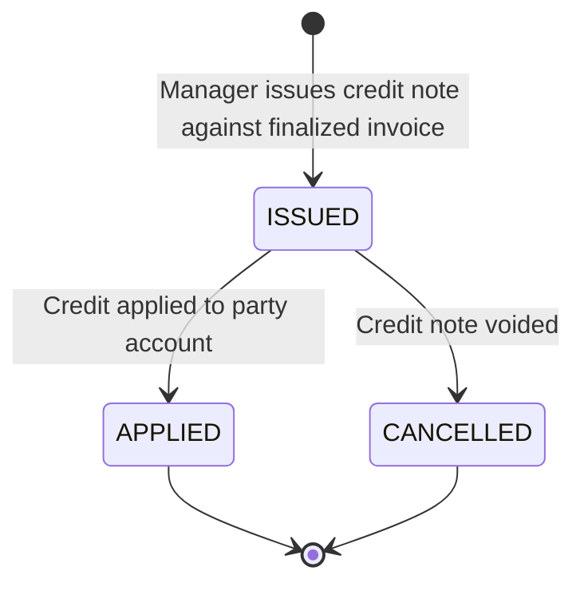

**Transitions & Rules:**

| From | To | Trigger | Business Rule |
|---|---|---|---|
| — | ISSUED | MANAGER+ issues against finalized invoice | `total <= original invoice total`; JE-05 posted (DR Revenue / CR Receivable) |
| ISSUED | APPLIED | System applies to party balance | Reduces AR; if overpaid, excess → advance liability (2010) |
| ISSUED | CANCELLED | Voided before application | Reversal JE posted |

---

## 8. Journal Entry Lifecycle

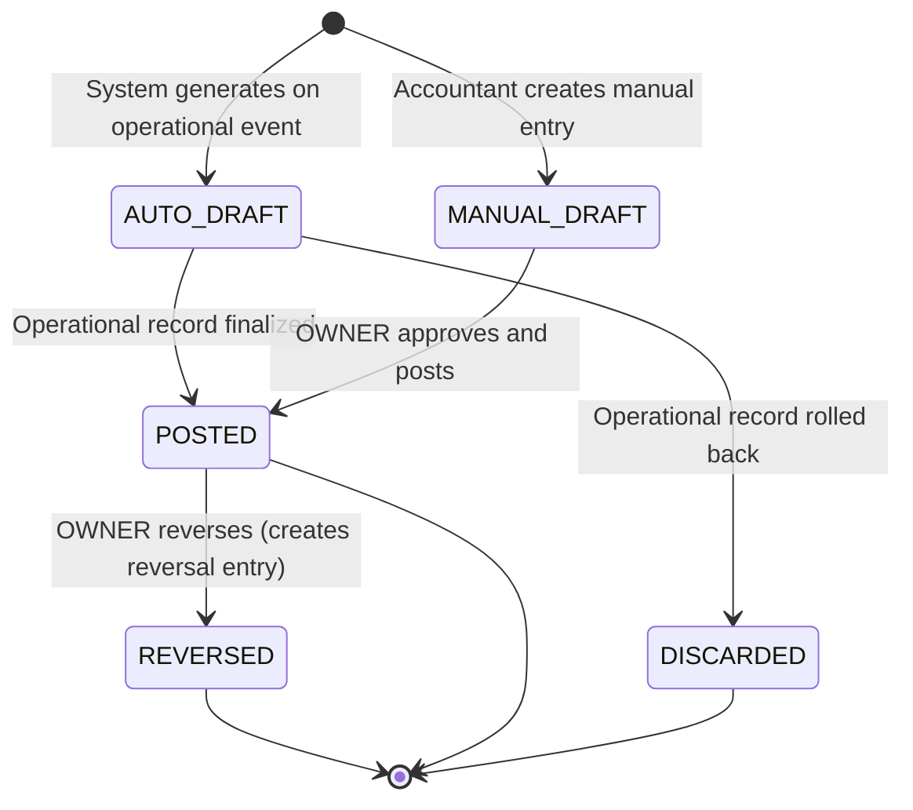

**Transitions & Rules:**

| From | To | Trigger | Business Rule |
|---|---|---|---|
| — | AUTO_DRAFT | Operational event fires (invoice, payment, etc.) | Balanced debit/credit required |
| AUTO_DRAFT | POSTED | Source record finalized | Atomically committed with operational record |
| AUTO_DRAFT | DISCARDED | Source record fails validation | No orphan JEs in GL |
| — | MANUAL_DRAFT | Accountant creates (depreciation, salary accrual) | Balanced lines required |
| MANUAL_DRAFT | POSTED | OWNER approves | period must be unlocked |
| POSTED | REVERSED | OWNER reverses | Creates new JE with swapped debits/credits; references original |

> **Immutability**: POSTED entries cannot be UPDATE'd or DELETE'd. Only reversals.

---

## 9. Expense Voucher Lifecycle

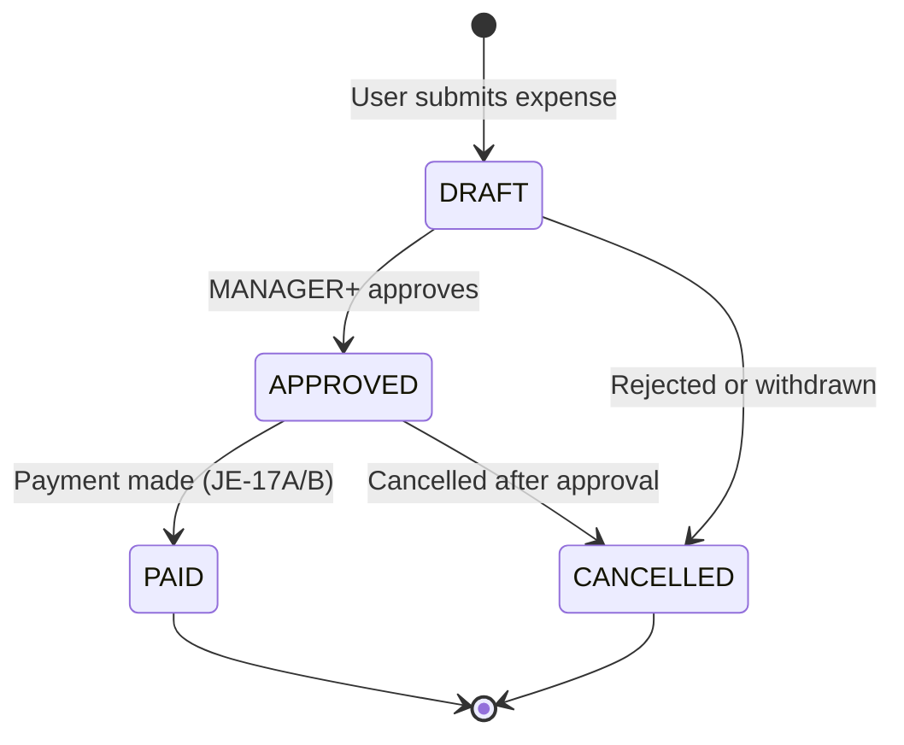

---

## 10. Fixed Asset Lifecycle

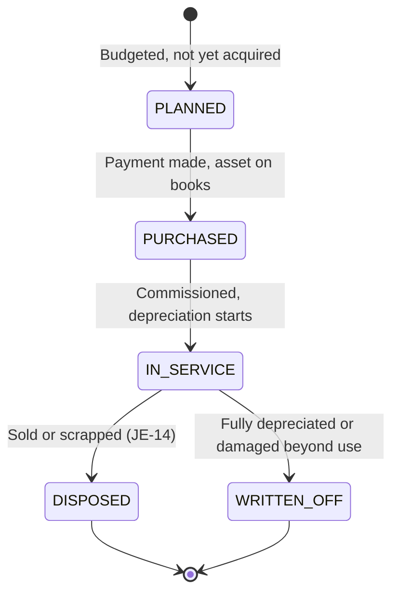

---

## 11. Party Loan (Peshgi) Lifecycle

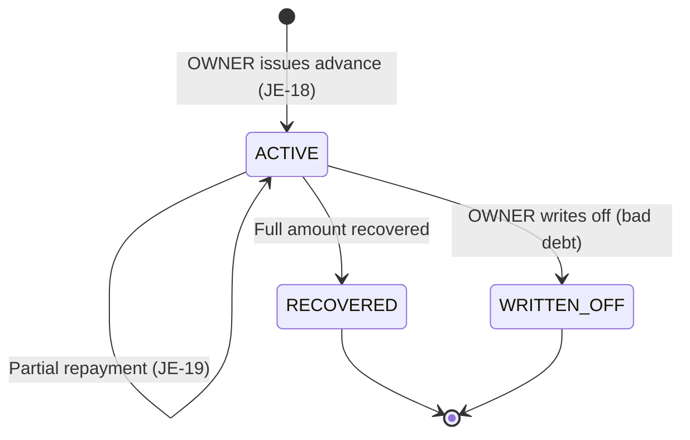

---

## 12. Payroll Run Lifecycle

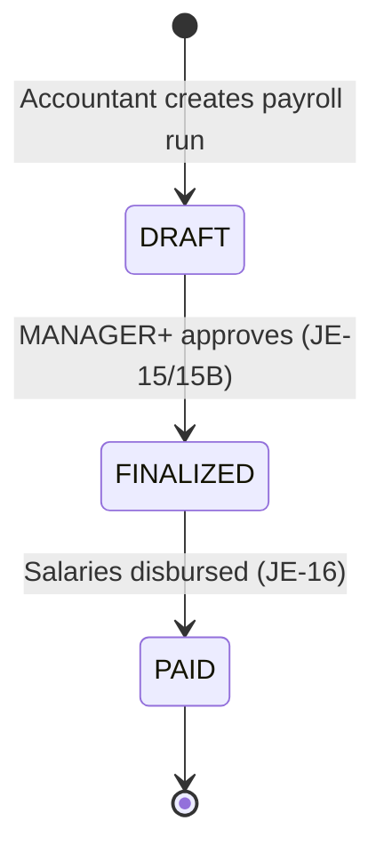
